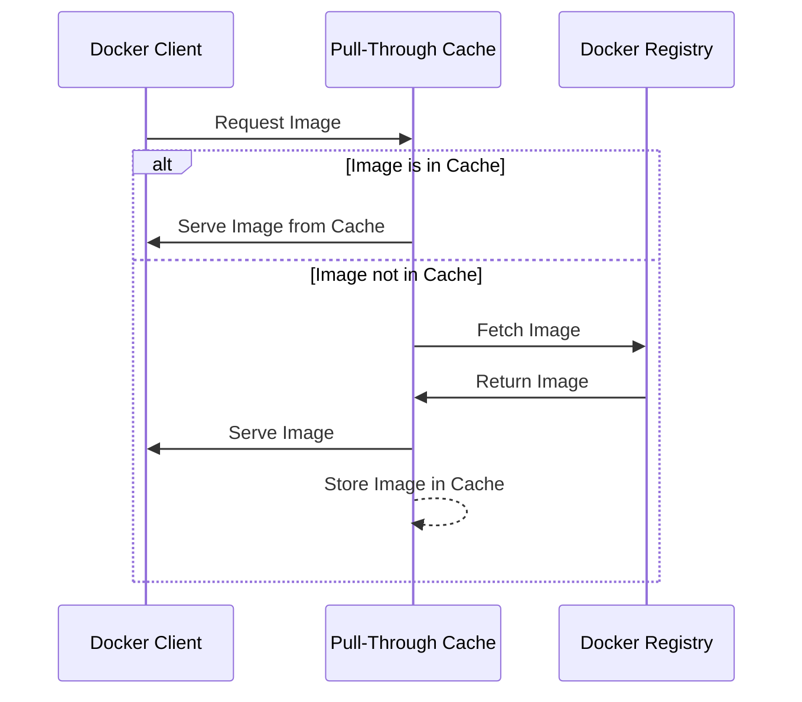

# Elastic Container Registry

Demonstrate how to use the `awscli` with ECR  

## Background

ECR, or Elastic Container Registry, is a service provided by Amazon Web Services (AWS) and has several notable features:

* **Fully Managed Service**: ECR is a fully managed Docker container registry that makes it easy for developers to store, manage, and deploy Docker container images.

* **Integrated with Amazon ECS and EKS**: ECR is seamlessly integrated with Amazon Elastic Container Service (ECS) and Amazon Elastic Kubernetes Service (EKS), simplifying your development to production workflow.

* **Security**: ECR includes features such as image scanning to detect vulnerabilities, and it integrates with AWS Identity and Access Management (IAM), allowing you to define policies to control access to your images.

* **High Scalability and Availability**: Being an AWS service, ECR is highly scalable and available, making it suitable for handling large volumes of traffic and storage.

* **Private Repositories**: You can create private Docker repositories in ECR, ensuring your container images are stored in a secure and private environment.

* **Layer Caching**: ECR optimizes the storage of Docker images by caching layers, which reduces the time required to download and upload images.

* **Region-based Storage**: You can store your Docker images in multiple AWS regions, ensuring low latency and high redundancy.

* **Lifecycle Policy Management**: ECR supports lifecycle policy management, allowing you to automatically clean up old or unused images.

* **Image Tagging and Organization**: It provides features for tagging and organizing images, which simplifies the management of different versions and variants of your container images.

* **Integration with AWS Developer Tools**: ECR can be integrated with other AWS developer tools and services, enhancing the overall efficiency of the CI/CD pipeline.

* **Support for Public and Private Images**: ECR supports both public and private images, enabling you to share your images with others or keep them confidential within your organization.

* **Registry Authentication**: ECR uses token-based authentication, which integrates with standard Docker CLI tools for easy authentication and management.

These features make ECR a powerful and versatile tool for managing Docker container images, especially in a cloud-based environment.  

## Useful content

* OCI Registry-as-Storage (ORAS) [here](https://github.com/chrisguest75/docker_examples/tree/master/81_oras)  
* Secrets Manager [here](SECRETS_MANAGER.md)

## Table of contents

- [Elastic Container Registry](#elastic-container-registry)
  - [Background](#background)
  - [Useful content](#useful-content)
  - [Table of contents](#table-of-contents)
  - [Login](#login)
  - [Listing](#listing)
  - [Pushing](#pushing)
  - [Pull through cache](#pull-through-cache)
    - [Create](#create)
  - [Resources](#resources)

TODO:

* Calculate number of images.  
* Get tags
* Get policies etc.

## Login

```sh
# to be able to pull images locally
aws ecr get-login-password --region eu-west-1 | docker login --username AWS --password-stdin "xxxxxxxxxxxx.dkr.ecr.eu-west-1.amazonaws.com"
```

## Listing

Listing registries and respositories.  

A `registry` contains `repositiories` and `repositories` contain images.  

```sh
export PAGER=

# describe any parameters on the registry
aws ecr describe-registry --profile my-profile

# list repositories
aws --no-cli-pager ecr describe-repositories  | jq .
```


```sh
# image name without registry name
aws ecr describe-images --repository-name imagename --region eu-west-1

# get a table of image tags and their sha1 id to compare
AWS_PROFILE=myprofile aws ecr describe-images --repository-name myimagename --region us-east-1 | jq -r '.imageDetails[] | [.imageDigest, (.imageTags // [])[]] | @tsv'

# get details on a specific image
AWS_PROFILE=myprofile aws ecr describe-images --repository-name myimagename --output table --query 'imageDetails[]' --image-ids imageTag=mytag
```

## Pushing

Pushing images to new repositories  

```sh
# create a new repository
REPOSITORY_URL=$(aws ecr create-repository --repository-name apprunner-test --region eu-west-1 | jq .repository.repositoryUri)
echo $REPOSITORY_URL

# registry/imagename:tag
docker tag nginx:1.20.1 xxxxxxxxxxxx.dkr.ecr.eu-west-1.amazonaws.com/apprunner-test:nginx-1-20-1

# login so we can push
aws ecr get-login-password --region eu-west-1 | docker login --username AWS --password-stdin "xxxxxxxxxxxx.dkr.ecr.eu-west-1.amazonaws.com"

# push image
docker push xxxxxxxxxxxx.dkr.ecr.eu-west-1.amazonaws.com/apprunner-test:nginx-1-20-1

# delete the repository
aws ecr delete-repository --repository-name apprunner-test --region eu-west-1 | jq -r .repository.repositoryUri
```

## Pull through cache



### Create

You'll need a pull secret in `Secrets Manager` and dockerhub needs to be called `docker.io` with official images coming from `/docker.io/library/`.  

```sh
# login to ecr registry
export AWS_PROFILE=my-profile
export AWS_REGION=us-east-1

# get registry account id
aws --no-cli-pager ecr describe-registry

# login to docker locally
aws ecr get-login-password | docker login --username AWS --password-stdin 000000000000.dkr.ecr.us-east-1.amazonaws.com

# are there any rules?
aws --no-cli-pager ecr describe-pull-through-cache-rules | jq . 

# delete old rules if required
aws --no-cli-pager ecr delete-pull-through-cache-rule --ecr-repository-prefix "docker-hub"

# create a pullsecret 
aws --no-cli-pager secretsmanager create-secret --name ecr-pullthroughcache/dockerpullsecret-test --secret-string '{"username":"myuser","accessToken":"mypass"}'

# create rule to attach pull through
aws --no-cli-pager ecr create-pull-through-cache-rule --ecr-repository-prefix docker.io --upstream-registry-url registry-1.docker.io --credential-arn  "arn:aws:secretsmanager:us-east-1:000000000000:secret:ecr-pullthroughcache/dockerpullsecret-test-xxxxxx" 

# create a docker.io rules
docker pull 000000000000.dkr.ecr.us-east-1.amazonaws.com/docker.io/library/{UpstreamRepositoryName}:{ImageTag}

# pull a new image locally (this will create a remote registry cache)
docker pull 000000000000.dkr.ecr.us-east-1.amazonaws.com/docker.io/library/redis
docker pull 000000000000.dkr.ecr.us-east-1.amazonaws.com/docker.io/library/nginx:1.25.1

# use oras to list repositories
oras repository ls 000000000000.dkr.ecr.us-east-1.amazonaws.com

# show pulled tags
oras repository show-tags 000000000000.dkr.ecr.us-east-1.amazonaws.com/docker.io/library/redis
```

## Resources

* AWS CLI ECR [here](https://awscli.amazonaws.com/v2/documentation/api/latest/reference/ecr/index.html)  
* Using pull through cache rules [here](https://docs.amazonaws.cn/en_us/AmazonECR/latest/userguide/pull-through-cache.html)
* Troubleshooting pull through cache issues [here](https://docs.aws.amazon.com/AmazonECR/latest/userguide/error-pullthroughcache.html)
* Creating a pull through cache rule [here](https://docs.aws.amazon.com/AmazonECR/latest/userguide/pull-through-cache-creating-rule.html)
